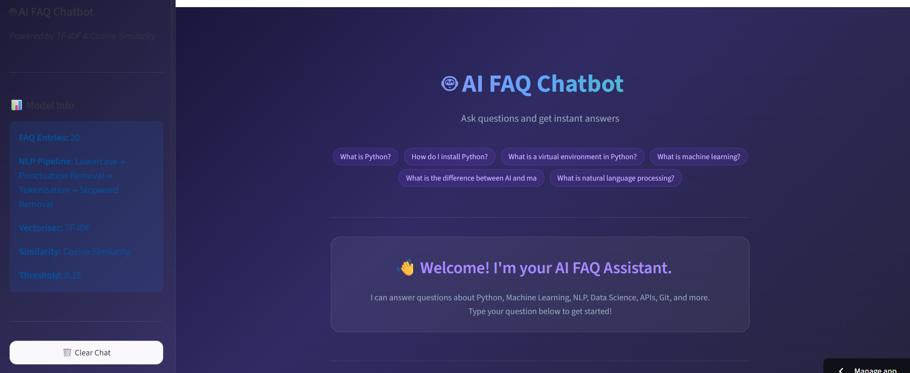
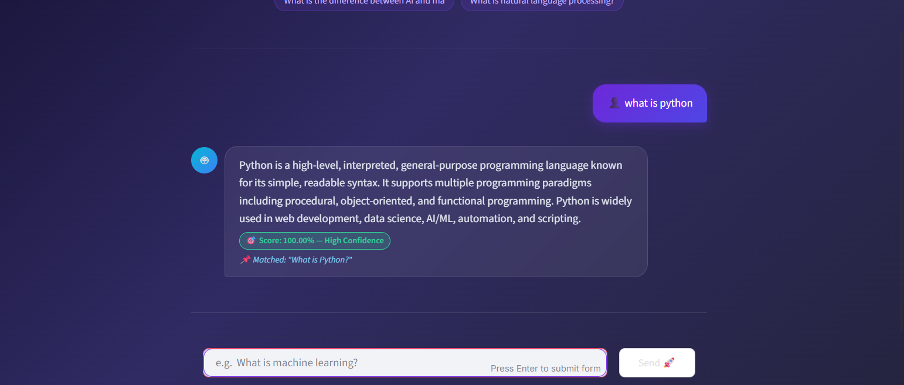

# 🤖 AI FAQ Chatbot — CodeAlpha AI Internship Project


---

## 📌 Project Overview

The **AI FAQ Chatbot** is an intelligent question-answering system developed as part of the **CodeAlpha AI Internship** programme. It uses **Natural Language Processing (NLP)** techniques to understand a user's question and retrieve the most relevant answer from a pre-built FAQ dataset — without any external AI API.

The chatbot demonstrates core NLP and information-retrieval concepts in a clean, interactive web interface powered by **Streamlit**.

---

## ✨ Features

| Feature | Description |
|---|---|
| 💬 **Interactive Chat UI** | Real-time chat interface with user & bot bubbles |
| 🧠 **NLP Preprocessing** | Lowercase → Punctuation removal → Tokenisation → Stopword removal |
| 📐 **TF-IDF Vectorisation** | Converts text to numerical feature vectors |
| 🎯 **Cosine Similarity Matching** | Finds the semantically closest FAQ answer |
| 📊 **Confidence Score Display** | Shows similarity score with colour-coded badges |
| 📝 **Chat History** | Full session history preserved in memory |
| 🗑️ **Clear Chat Button** | Reset the conversation with one click |
| 💡 **FAQ Examples Panel** | Sidebar with clickable sample questions |
| 🚀 **Loading Animation** | Spinner shown while processing the query |
| ⚠️ **Fallback Response** | Graceful reply when confidence is too low |
| 📱 **Responsive Design** | Works seamlessly on desktop and mobile |

---

## 🛠️ Technologies Used

| Technology | Purpose |
|---|---|
| **Python 3.10+** | Core programming language |
| **Streamlit** | Web interface framework |
| **NLTK** | Tokenisation & stopword removal |
| **Scikit-learn** | TF-IDF Vectorizer & Cosine Similarity |
| **Pandas** | FAQ data management |
| **re / string** | Text preprocessing utilities |

---

## 📁 Project Structure

```
CodeAlpha_FAQ_Chatbot/
│
├── app.py            ← Main Streamlit application
├── faq_data.py       ← FAQ dataset (20 Q&A entries)
├── requirements.txt  ← Python dependencies
├── README.md         ← Project documentation
└── assets/           ← Screenshots / media
```

---

## 🚀 Installation & Setup

### Prerequisites
- Python 3.10 or higher
- pip (Python package manager)

### Step 1 — Clone the Repository
```bash
git clone https://github.com/your-username/CodeAlpha_FAQ_Chatbot.git
cd CodeAlpha_FAQ_Chatbot
```

### Step 2 — Create a Virtual Environment (Recommended)
```bash
# Create
python -m venv venv

# Activate (Windows)
venv\Scripts\activate

# Activate (macOS / Linux)
source venv/bin/activate
```

### Step 3 — Install Dependencies
```bash
pip install -r requirements.txt
```

### Step 4 — Run the Application
```bash
streamlit run app.py
```

The app will open automatically in your browser at **http://localhost:8501**.

---

## 🧠 How the NLP Model Works

```
User Question
     │
     ▼
┌─────────────────────────────────────────────┐
│             Text Preprocessing              │
│  1. Lowercase          "What is Python?"    │
│  2. Remove Punctuation "what is python"     │
│  3. Tokenise           ["what","is","python"]│
│  4. Remove Stopwords   ["python"]           │
└─────────────────────────────────────────────┘
     │
     ▼
┌─────────────────────────────────────────────┐
│          TF-IDF Vectorisation               │
│  Convert cleaned text → numerical vector   │
│  Rare & meaningful words get higher weight │
└─────────────────────────────────────────────┘
     │
     ▼
┌─────────────────────────────────────────────┐
│           Cosine Similarity                 │
│  Compare user vector vs. all FAQ vectors   │
│  Score range: 0.0 (no match) → 1.0 (exact)│
└─────────────────────────────────────────────┘
     │
     ▼
┌─────────────────────────────────────────────┐
│           Answer Retrieval                  │
│  Score ≥ 0.15 → return best match answer   │
│  Score < 0.15 → return fallback message    │
└─────────────────────────────────────────────┘
```

### Key Concepts Explained

**TF-IDF (Term Frequency–Inverse Document Frequency)**
- **TF**: How often a word appears in a document (higher = more relevant to *that* doc)
- **IDF**: Penalises words that appear in *many* documents (common words like "the" get low weight)
- **TF-IDF = TF × IDF**: Words rare in the corpus but frequent in the document get high scores

**Cosine Similarity**
- Measures the *angle* between two vectors (text documents)
- Returns a value between 0 and 1 — higher means more similar
- Works well for text because it ignores document length

---

## 🖼️ Screenshots

> Add screenshots to the `assets/` folder after running the app.

| Home Screen | Chat in Action |
|---|---|
|  |  |

---

## 🔮 Future Enhancements

- [ ] **Machine Learning Model** — Replace TF-IDF with sentence-transformers (BERT embeddings) for semantic search
- [ ] **Dynamic FAQ Loading** — Load FAQs from a CSV or database
- [ ] **Voice Input** — Add speech-to-text functionality
- [ ] **Multi-language Support** — Add translation layer for non-English queries
- [ ] **Admin Panel** — UI to add/edit/delete FAQ entries at runtime
- [ ] **Analytics Dashboard** — Track most asked questions and unanswered queries
- [ ] **Export Chat** — Allow users to download chat history as PDF/TXT
- [ ] **Dark/Light Mode Toggle** — Theme switcher for accessibility

---

## 👨‍💻 Author

**CodeAlpha Intern**
- 🏢 Organisation: [CodeAlpha](https://www.codealpha.tech/)
- 📧 Task: AI Internship — Task 1: FAQ Chatbot

---

## 📄 License

This project is licensed under the **MIT License** — see the [LICENSE](LICENSE) file for details.

---

*Built with ❤️ using Python · Streamlit · NLTK · Scikit-learn*
